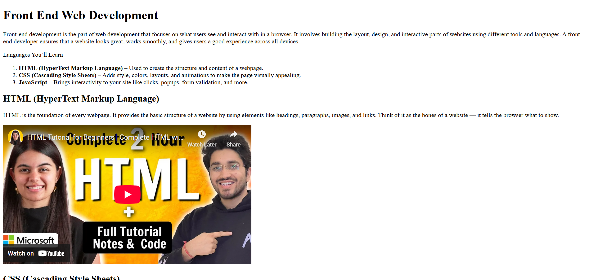

# 🎥 Front-End Development Video Compilation

This is a simple HTML project that compiles YouTube videos to help beginners learn the three core technologies of front-end web development: HTML, CSS, and JavaScript. Each section includes a short explanation and an embedded video for visual learning.

## 📚 What This Project Covers
- 📄 Introduction to Front-End Development
- 🔤 HTML (HyperText Markup Language)
- 🎨 CSS (Cascading Style Sheets)
- ⚙️ JavaScript Basics

## 💡 Purpose
This project helped me understand how to structure a basic webpage and use `<iframe>` to embed external content like YouTube videos. It's part of my journey to become a skilled front-end developer.

## 🔧 Tools Used
- HTML5
- YouTube embeds via `<iframe>`

## 📸 Screenshot

## 🌐 Live Demo
[Visit Project](https://codewithsam025.github.io/video-compilation-page/)

